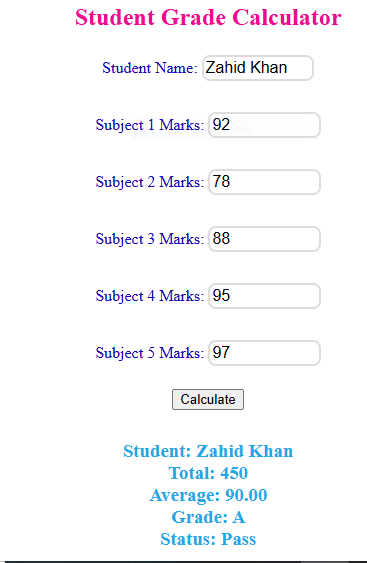

# Student Grade Calculator 🎓

**🔗 Live Demo:** [https://zahidullahtandidev.github.io/Grade-calculator/](https://zahidullahtandidev.github.io/Grade-calculator/)

### 📸 Preview

### ✨ Features
- Input student name and marks for 5 subjects
- Auto-calculates Total Marks, Percentage, Grade (A-F), and Pass/Fail status
- Clean, responsive UI that works on mobile and desktop
- Built with pure HTML, CSS, and JavaScript - no frameworks

### 🛠️ Tech Stack
- **Frontend:** HTML5, CSS3, JavaScript (ES6)
- **Deployment:** GitHub Pages

### 🚀 How It Works
1. Enter student details and marks out of 100
2. Click "Calculate" 
3. Get instant results with grade evaluation

### 👨‍💻 Author
**Zahid Ullah Khan**  
GitHub: [@zahidullahtandidev](https://github.com/zahidullahtandidev)
